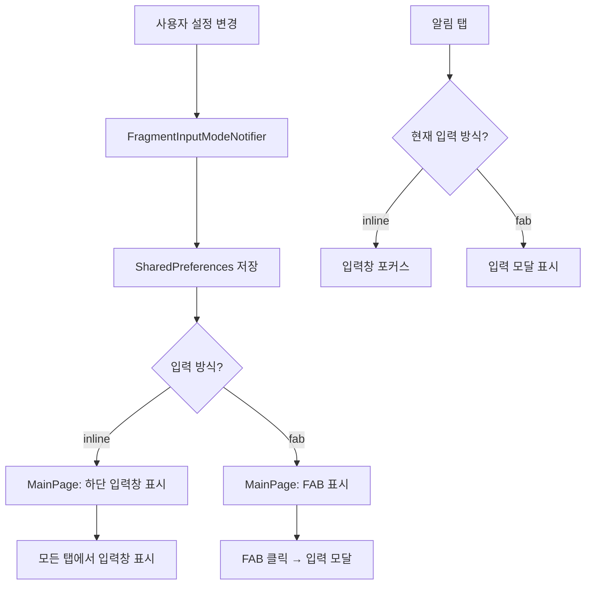

# Fragment 입력 방식 옵션

## 무엇을 만드는가

사용자가 Fragment 입력 UI 방식을 선택할 수 있는 설정 기능. inline 모드(하단 고정 입력창)와 fab 모드(플로팅 버튼 + 모달)를 지원하여 사용자 선호도에 맞는 입력 경험 제공.

## 유저 시나리오

### 주요 플로우

1. 사용자가 설정 > 입력 방식 메뉴 선택
2. 입력 방식 선택 바텀시트 표시 (inline / fab)
3. 원하는 방식 선택 → 설정 저장
4. 메인 화면에서 선택한 방식으로 입력 UI 표시
   - inline: 화면 하단 고정 입력창 (모든 탭에서 표시)
   - fab: FloatingActionButton (탭 시 입력 모달 표시)

### 엣지 케이스

- **알림 탭 처리**: Daily reminder 알림 탭 시
  - inline 모드: 입력창 포커스
  - fab 모드: 입력 모달 자동 표시
- **모드 전환**: 설정 변경 시 즉시 UI 반영 (앱 재시작 불필요)
- **Calendar 모드**: Timeline/Calendar 뷰 전환 시에도 선택한 입력 방식 유지
- **키보드 애니메이션**: inline 모드에서 키보드 표시/숨김 시 입력창 애니메이션 동작

## 논리 흐름

## E2E 테스트

### 정상 플로우

- [ ] 완전한 플로우: 설정 변경 → 메인 화면 → Fragment 입력 → 저장 → 목록 확인
- [ ] 원본 데이터 보존: 입력 방식과 무관하게 동일한 데이터 저장/동기화
- [ ] 모드 전환: inline ↔ fab 전환 시 즉시 UI 반영 (데이터 유실 없음)

### 입력 방식별 동작 검증

#### inline 모드
- [ ] 모든 탭(Timeline/Drafts/Posts)에서 하단 입력창 표시
- [ ] 키보드 표시 시 입력창이 키보드 위로 올라감
- [ ] 알림 탭 시 입력창 자동 포커스
- [ ] Timeline/Calendar 뷰 전환 시 입력창 유지

#### fab 모드
- [ ] 모든 탭에서 FloatingActionButton 표시
- [ ] FAB 탭 시 입력 모달 표시
- [ ] 모달에서 Fragment 입력 → 저장 → 모달 닫힘
- [ ] 알림 탭 시 입력 모달 자동 표시
- [ ] 모달 배경색이 StandardBottomSheet와 일치 (theme.colorScheme.muted)

### 설정 영속성

- [ ] 앱 재시작 후에도 선택한 입력 방식 유지
- [ ] 다른 기기에서는 독립적으로 설정 (동기화 안됨)
- [ ] Analytics 이벤트 전송 확인 (fragment_input_mode_changed)

### 예외 시나리오

- [ ] 설정 변경 중 앱 종료 → 재시작 시 이전 설정 유지 (저장 완료 전)
- [ ] 키보드 표시 중 모드 전환 → 키보드 숨김 후 새 UI 표시
- [ ] Calendar 뷰에서 모드 전환 → Timeline으로 돌아올 때 새 입력 방식 적용

## 관련 문서

- [Fragment 입력 방식 구현](./IMPLEMENTATION.md)
- [설정 관리 가이드](/docs/flutter/USER_STATE_MANAGEMENT_GUIDE.md)
- [컴포넌트 명세](../../COMPONENT_SPECS.md)
- [Modal/Dialog/Sheet 규칙](../../MOBILE_DIALOG_SHEET_RULES.md)

---

**작성 후 확인:**
- [x] 1-2문장 요약이 명확한가?
- [x] 엣지 케이스를 빠뜨리지 않았는가? (알림, 모드 전환, Calendar)
- [x] E2E 테스트에 "완전한 플로우"가 있는가?
- [x] 300-500줄 이내인가?
